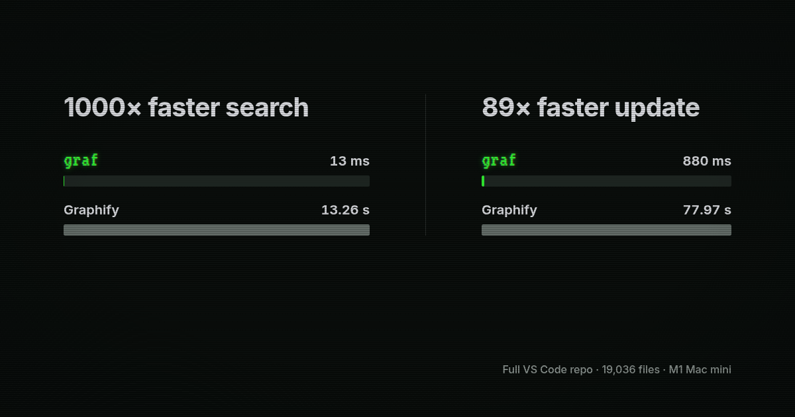

<div className="ctx-home-title-block">
  <div className="ctx-home-title-heading" role="heading" aria-level="1">
    <span className="ctx-home-title-line"><span className="ctx-home-title-wordmark ctx-home-title-wordmark-terminal">graf</span> is graphify, rebuilt in rust</span>
    <span className="ctx-home-title-line">for 1000x faster search</span>
  </div>
</div>

Graphify started with a great idea and became popular fast. The problem is that its Python/NetworkX architecture does not scale well. It installs about 30 direct dependencies, and the CLI reloads the entire graph into memory for every query. On a large repo, that can make each search slow enough to drag down an agent’s entire task.

Graf is a rewrite in Rust. It keeps the graph indexed in SQLite, so searches query the database directly and updates only touch changed files. Static indexing and search run as one native binary with no Python environment, API key, model, or background service.

If you aren’t familiar with Graphify, it’s like a local version of Sourcegraph: it builds a graph of your codebase and docs so an agent can ask who calls something, what depends on it, and what might break if it changes.

You might not need Graf or Graphify for a smaller project. Agents are surprisingly good at getting around a codebase using normal read and search tools. On a larger project, Graf gives them a much faster way to follow relationships across files instead of spending tokens repeatedly searching the repository.

**If you train coding models, try giving Graf to the agents in your rollouts.**

## Install

macOS and Linux:

```bash
curl -fsSL https://raw.githubusercontent.com/ctxrs/graf/main/install.sh | sh
```

Windows PowerShell:

```powershell
irm https://raw.githubusercontent.com/ctxrs/graf/main/install.ps1 | iex
```

The same command upgrades an existing install. See [installation and downloads](docs/downloads.md) for manual downloads, verification, supported platforms, and custom directories.

## Try it

From any project:

```bash
graf index .
graf stats
graf query authenticate
```

Replace `authenticate` with a symbol from your project, then copy its exact ID into an impact query. That shows the symbol, the code that depends on it, and the relationship between them:

```text
$ graf impact 'python:src/auth.py:authenticate@64'
Generation 1 (indexed snapshot)
python:src/auth.py:authenticate@64  function  authenticate  src/auth.py:4
python:src/auth.py:login@136         function  login         src/auth.py:7
python:src/auth.py:login@136 --calls--> python:src/auth.py:authenticate@64
```

Graf saves the graph at `.graf/index.db`. After changing code, update only what changed:

```bash
graf update
```

Use `--json` for structured output and an exact node ID when a name is ambiguous. The [usage guide](docs/usage.md) covers callers, callees, paths, filters, reports, exports, multiple projects, and supported inputs.

## Why Graf is better than Graphify

Graf is Graphify, but rebuilt properly in Rust: **1000x faster search, 89x faster updates, and one native binary.**



It is also stricter about correctness. Updates become visible as one complete generation, so a failed extraction cannot publish half a graph. When two symbols could be the answer, Graf returns the ambiguity and the source evidence instead of guessing.

Graf is an independent implementation, not a fork or a drop-in replacement for Graphify's Python API. The chart uses the complete 19,036-file VS Code repository on an M1 Mac mini. Cold indexing was effectively tied, while Graf produced 2.4x as many nodes and 1.7x as many edges with 31% less peak memory. See the [benchmark method, results, and tradeoffs](docs/benchmarks.md).

## Migrate from Graphify

Install Graf using the command above, then run this from a project that already has `graphify-out/graph.json`:

```bash
graf switch graphify
```

That imports the existing snapshot into `.graf/index.db`, switches a supported project MCP connection, and verifies the new server. It leaves Graphify, the original graph, skills, and hooks in place.

The migration is reversible:

```bash
graf switch --undo
```

See [migrating from Graphify](docs/migrate-from-graphify.md) for Windows, custom graph paths, MCP configuration selection, compatibility details, and undo behavior.

## Use Graf with an agent

Install project guidance and a read-only MCP connection for Codex:

```bash
graf install --platform codex --project . --skill --mcp
```

Setup can be undone and does not overwrite unrelated configuration. See [agent setup and MCP](docs/usage.md#agent-setup-and-mcp) for Claude Code, Cursor, Gemini, VS Code, Aider, and other hosts.

## Build from source

Graf requires Rust 1.90 or newer and a C compiler:

```bash
cargo install --path . --locked
```

Graf is licensed under Apache-2.0. It is an independent project inspired by [Graphify](https://github.com/Graphify-Labs/graphify).
