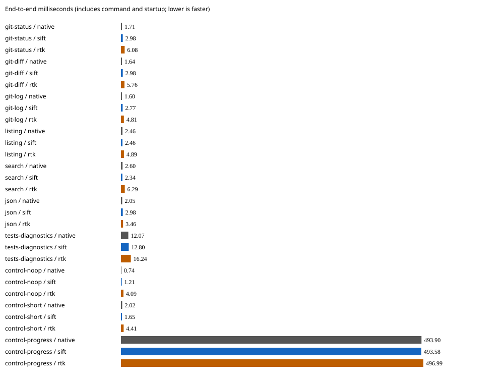
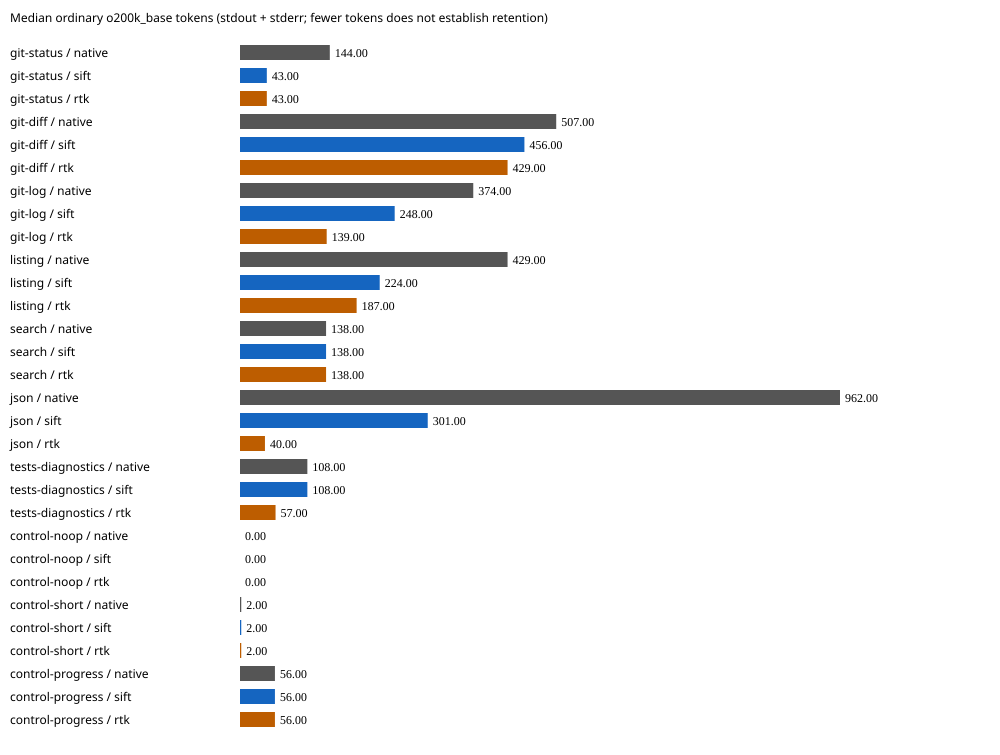

# Release v0.4.0 synthetic comparison — 2026-09-21

These measurements use the **final Linux x64 Sift v0.4.0 release binary**.
Across all ten rows, Sift's median elapsed time was within 1.35 ms of native
and lower than RTK's. On the seven non-control workloads, Sift took 2.3–12.8 ms,
versus native's 1.6–12.1 ms and RTK's 3.5–16.2 ms. RTK still emitted fewer
tokens on five workloads and tied Sift on two. Sift preserved the requested
command and exit status. Non-JSON encodings restored byte-for-byte, while JSON
preserved values, types and numeric lexemes. The Git status view retained its
displayed paths and branch under separate view checks. RTK's command-specific
transformations differ, as detailed below. No
aggregate winner or model-task-success claim follows from these small fixtures.

## Identity and measurements

- Sift 0.4.0 SHA-256: `1cddaa3eb215733ffb206ec9cb47a61636ee0197ef2c6e397e14142ebe9bffc7`
- RTK 0.49.0 SHA-256: `dd97f3c0a08f91ed90d3e87e05520c448bfda112b3cb101847ccb4d5444c9b07`
- Sift source: `f347342fd6929a0d0a5a6afe48c74e6d2dfee299`

Seven timed repeats per arm after one warmup, rotating arm order and warm filesystem
caches on a shared Linux host. Hashes were unchanged afterward. Times include
startup, child execution and local tracking. Tokens count actual stdout and stderr
separately as ordinary `o200k_base`, using the same warmed Sift tokenizer for all
arms. Counts were stable across repeats. This is not an independent tokenizer
comparison or a memory, billing, agent-success or first-byte-latency measurement.

| Workload | Native tokens | Sift tokens | RTK tokens | Native ms | Sift ms | RTK ms |
| --- | ---: | ---: | ---: | ---: | ---: | ---: |
| git-status | 144 | 43 | 43 | 1.710 | 2.981 | 6.078 |
| git-diff | 507 | 456 | 429 | 1.637 | 2.982 | 5.759 |
| git-log | 374 | 248 | 139 | 1.600 | 2.768 | 4.808 |
| listing | 429 | 224 | 187 | 2.460 | 2.462 | 4.888 |
| search | 138 | 138 | 138 | 2.596 | 2.345 | 6.292 |
| json | 962 | 301 | 40 | 2.054 | 2.979 | 3.463 |
| tests-diagnostics | 108 | 108 | 57 | 12.074 | 12.796 | 16.240 |
| control-noop | 0 | 0 | 0 | 0.739 | 1.208 | 4.087 |
| control-short | 2 | 2 | 2 | 2.021 | 1.651 | 4.408 |
| control-progress | 56 | 56 | 56 | 493.905 | 493.583 | 496.993 |

[Sanitized samples and command audits](results.json) retain all elapsed samples,
output hashes, token counts, marker checks and protocol measurements;
[CSV](results.csv) contains summaries. Local paths, exact host and kernel identity,
and protocol text are omitted. These are synthetic fixtures, never historical
commands or user repositories.

## Execution and retention

All ten Sift workloads executed the requested command once with unchanged argv,
cwd and fixture contents. Timed exits matched native behavior, including the
intentional test failure. Encoded streams were restored with Sift's product
decoder and compared byte-for-byte; JSON was compared independently for values,
types and numeric lexemes while permitting whitespace and object-key order
changes. The Git status stdout uses a command-aware view, checked separately
for displayed paths and branch; it is not a reversible encoding.

RTK listing, tests and proxy controls passed the same native invocation audit.
Status and diff made additional or altered Git calls; log changed its format;
search changed flags. JSON used an internal reader and emitted the first record
plus a remaining-row count: the final record's marker was absent. Test output
moved the native stderr diagnostic into stdout. These observations describe the
actual representations, not inferred reread costs or semantic-retention scores.
Missing literal markers in Sift's reversible encoding restored correctly.

No-op and progress controls show passthrough behavior; RTK uses `proxy` for them.
Sift bypasses tiny output and streams progress after its capture window. The
separate warmed-protocol times in the JSON exclude tokenizer startup and include
serialization/pipe overhead; they are not comparable to whole-command RTK times.

See the [harness and complete method](../../README.md) for fixture definitions,
untimed PATH-shim audit limits, restoration rules and reproduction commands. The
[v0.3.0 release run](../2026-09-17-release-v0.3.0/README.md) and earlier
[v0.2.0 development run](../2026-09-17-development-v0.2.0/README.md) are retained;
their separate runs are not controlled before/after speed ratios.
